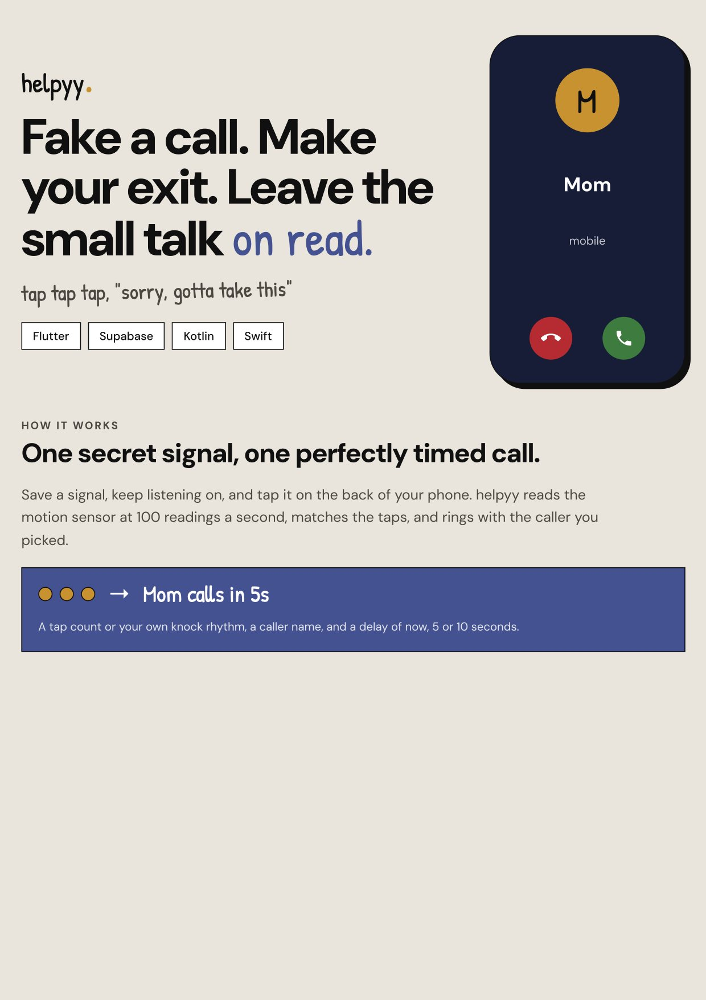
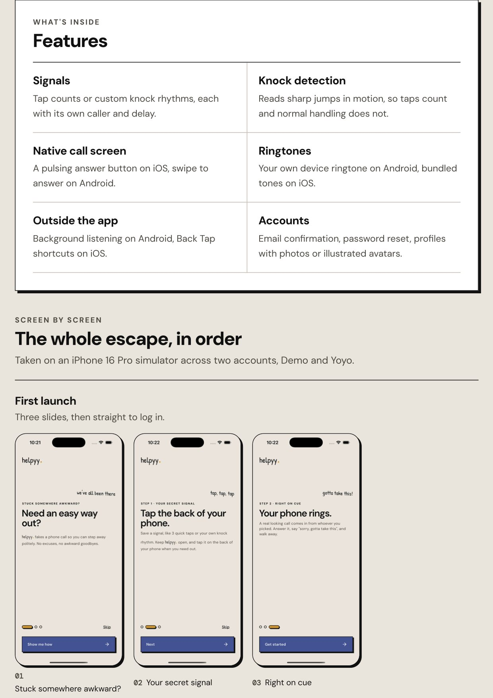
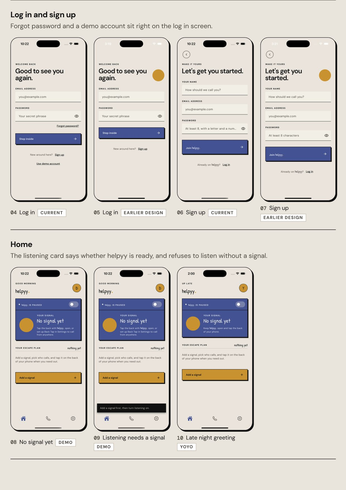
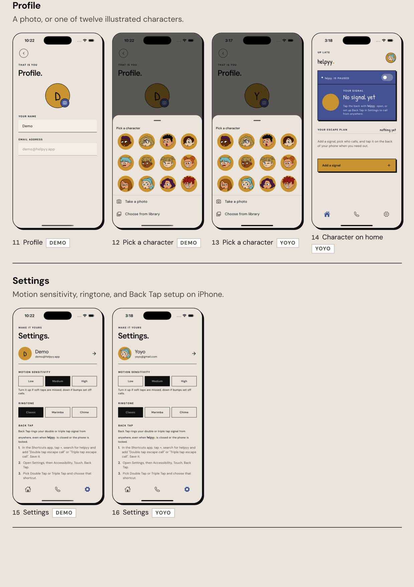
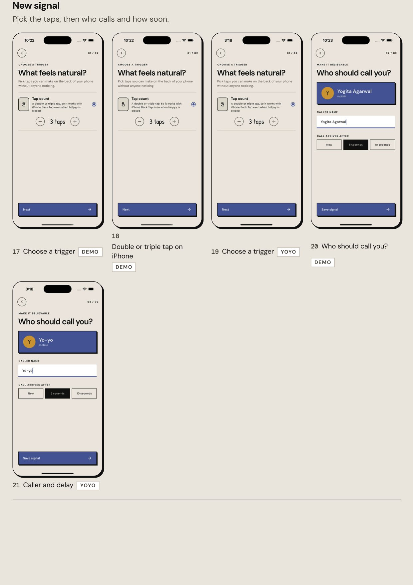
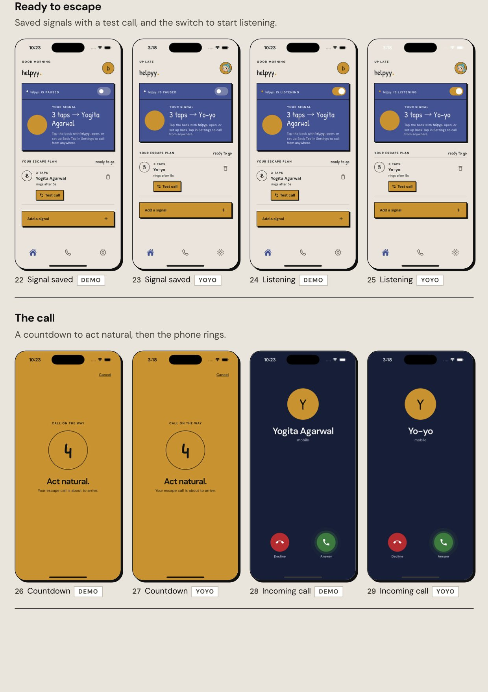
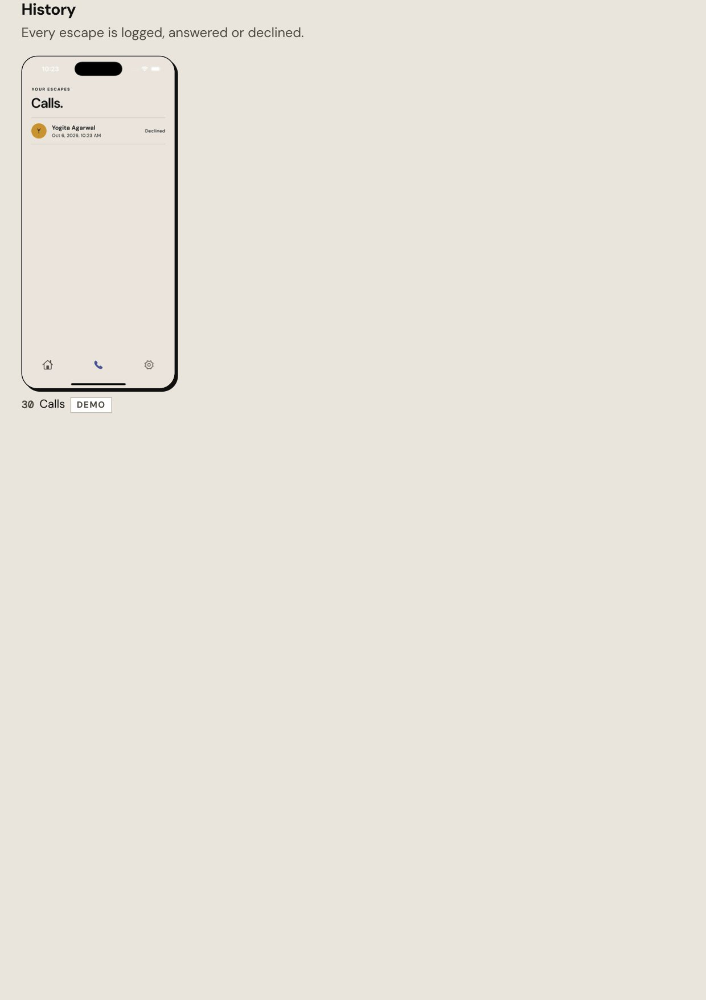
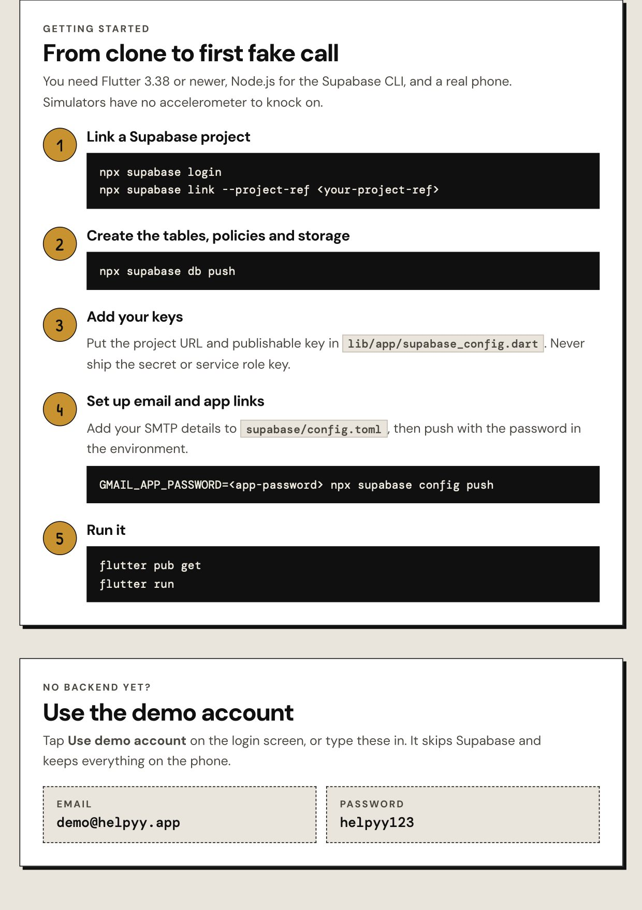
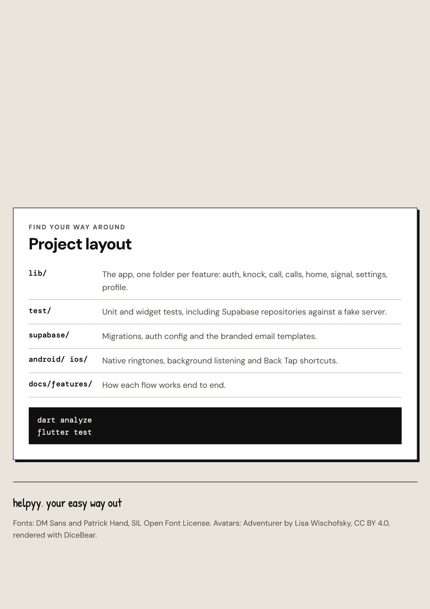

# helpyy

Fake a call. Make your exit. Leave the small talk on read.

## The guide

Tap any page to open the [PDF](docs/helpyy-guide.pdf). The setup commands are repeated as text below so they can be copied.

## Features

- Signals made of a tap count or a custom knock rhythm, each with its own caller and delay
- Knock detection from the accelerometer, tuned on real phones
- A call screen that looks native on each platform, with a pulsing answer button on iOS and swipe to answer on Android
- Device ringtones on Android and bundled tones on iOS
- Works outside the app: background listening on Android, and Back Tap shortcuts on iOS
- Call history, profiles with photos or illustrated avatars, and synced settings
- Accounts with email confirmation and password reset

## Stack

- Flutter with [flutter_bloc](https://pub.dev/packages/flutter_bloc)
- [Supabase](https://supabase.com) for auth, Postgres with row level security, and storage
- Native Kotlin and Swift for ringtones, background listening and App Intents

## Getting started

Requirements: Flutter 3.38 or newer, Node.js (for the Supabase CLI), and a real phone. Simulators have no accelerometer to knock on.

1. Create a Supabase project and link it:

       npx supabase login
       npx supabase link --project-ref <your-project-ref>

2. Create the tables, policies and storage bucket:

       npx supabase db push

3. Put your project URL and publishable key in `lib/app/supabase_config.dart`. Never use the secret or service role key in the app.

4. Point auth links at the app and set up email. Update `supabase/config.toml` with your own SMTP details, then push it, passing the SMTP password from the environment:

       GMAIL_APP_PASSWORD=<app-password> npx supabase config push

5. Run the app:

       flutter pub get
       flutter run

## Demo account

Tap **Use demo account** on the login screen, or log in with `demo@helpyy.app` and `helpyy123`. It skips Supabase entirely and keeps everything on the phone, so it works before the backend or email is set up.

## Checks

    dart analyze
    flutter test

## Project layout

- `lib/` the app, one folder per feature (`auth`, `knock`, `call`, `calls`, `home`, `signal`, `settings`, `profile`)
- `test/` unit and widget tests, including Supabase repositories against a fake server
- `supabase/` migrations, auth config and email templates
- `android/`, `ios/` native ringtone, background listening and Back Tap code
- `docs/features/` how each flow works end to end

## Platform notes

- iOS does not let apps read the motion sensor in the background or play the phone's own ringtones. Signals there are double or triple taps that ring through Back Tap (Settings, Accessibility, Touch, Back Tap), and calls use the tones bundled with the app.
- Android keeps listening in the background with a foreground service and shows the call over the lock screen with a full screen notification.

## Credits

- Fonts: DM Sans and Patrick Hand, under the SIL Open Font License (`assets/fonts`)
- Avatars: Adventurer by Lisa Wischofsky, CC BY 4.0, rendered with [DiceBear](https://www.dicebear.com)
